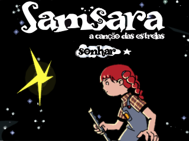
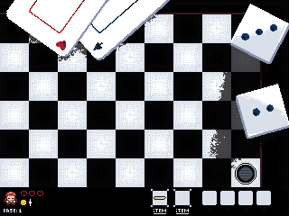
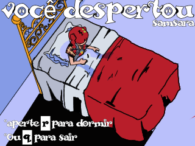
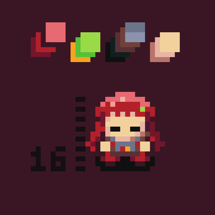

<div align="center">

# 🌟 Samsara: A Canção das Estrelas / The Song of the Stars


*Inspirado pela magia atemporal de The Legend of Zelda*

[](https://riscv.org/)
[](https://github.com)
[](https://github.com/fpgrars)

</div>

---

<table>
<tr>
<td width="50%" valign="top">

## 🇧🇷 Sobre o Projeto

**Samsara: A Canção das Estrelas** é um jogo de ação e aventura desenvolvido inteiramente em **Assembly RISC-V**, rodando no simulador **FPGRARS**. 

Mergulhe em uma experiência que captura a essência dos clássicos 8-bits, onde você controla **Samsara**, uma criança escolhida por uma estrela cadente para restaurar a harmonia dos reinos oníricos.

### ✨ Destaques
- 🎵 Sistema de combate baseado em notas musicais
- ♟️ Inimigos inspirados em peças de xadrez
- 🎨 Arte pixel estilo surrealista
- 🔊 Trilha sonora MIDI integrada
- 🗺️ Múltiplos mapas para explorar

</td>
<td width="50%" valign="top">

## 🇺🇸 About the Project

**Samsara: The Song of the Stars** is an action-adventure game fully developed in **RISC-V Assembly**, running on the **FPGRARS** simulator.

Dive into an experience that captures the essence of 8-bit classics, where you control **Samsara**, a child chosen by a falling star to restore harmony to the dream realms.

### ✨ Highlights
- 🎵 Musical note-based combat system
- ♟️ Chess piece-inspired enemies
- 🎨 Dreamlike surrealist pixel art
- 🔊 Integrated MIDI soundtrack
- 🗺️ Multiple maps to explore

</td>
</tr>
</table>

---

## 🖼️ Galeria / Gallery

<div align="center">

<table>
<tr>
<td align="center" width="50%">

<br><b>🏠 Menu / Title Screen</b>
</td>
<td align="center" width="50%">

<br><b>🗺️ Mapa 1 / Map 1</b>
</td>
</tr>
<tr>
<td align="center" width="50%">

<br><b>⚔️ Game Over</b>
</td>
<td align="center" width="50%">

<br><b>💤 Samsara</b>
</td>
</tr>
</table>

</div>

---

<table>
<tr>
<td width="50%" valign="top">

## 🎮 Controles

| Ação | Tecla |
|:-----|:-----:|
| Mover para cima | **W** |
| Mover para esquerda | **A** |
| Mover para baixo | **S** |
| Mover para direita | **D** |
| Atacar (nota musical) | **ESPAÇO** |

</td>
<td width="50%" valign="top">

## 🎮 Controls

| Action | Key |
|:-------|:---:|
| Move up | **W** |
| Move left | **A** |
| Move down | **S** |
| Move right | **D** |
| Attack (musical note) | **SPACE** |

</td>
</tr>
</table>

---

<table>
<tr>
<td width="50%" valign="top">

## ♟️ Bestiário

| Inimigo | Comportamento | Dificuldade |
|---------|--------------|-------------|
| 🐴 **Cavalo** | Movimento em L (xadrez) | ⭐⭐ |
| ⛪ **Bispo** | Movimento diagonal | ⭐⭐ |
| 🏰 **Torre** | Movimento horizontal | ⭐⭐⭐ |
| 👑 **Dama** | Persegue agressivamente (12 hits) | ⭐⭐⭐⭐⭐ |
| 🐑 **Carneiro** | Foge do jogador | ⭐ |

</td>
<td width="50%" valign="top">

## ♟️ Bestiary

| Enemy | Behavior | Difficulty |
|-------|----------|-----------|
| 🐴 **Knight** | L-shaped movement (chess) | ⭐⭐ |
| ⛪ **Bishop** | Diagonal sliding | ⭐⭐ |
| 🏰 **Rook** | Horizontal movement | ⭐⭐⭐ |
| 👑 **Queen** | Aggressively chases player (12 hits) | ⭐⭐⭐⭐⭐ |
| 🐑 **Sheep** | Runs away from player | ⭐ |

</td>
</tr>
</table>

---

<table>
<tr>
<td width="50%" valign="top">

## ⚙️ Stack Tecnológica

- 🔧 **RISC-V RV32I** - Arquitetura de processador
- 🖥️ **FPGRARS** - Simulador e ambiente de desenvolvimento
- 🎨 **Framebuffer 320×240** - Sistema gráfico
- 🔊 **MIDI Audio** - Sistema de áudio integrado
- 🖼️ **png2oac** - Conversor de sprites
- 🐍 **Python** - Scripts de conversão de música

</td>
<td width="50%" valign="top">

## ⚙️ Tech Stack

- 🔧 **RISC-V RV32I** - Processor architecture
- 🖥️ **FPGRARS** - Simulator and development environment
- 🎨 **Framebuffer 320×240** - Graphics system
- 🔊 **MIDI Audio** - Integrated audio system
- 🖼️ **png2oac** - Sprite converter
- 🐍 **Python** - Music conversion scripts

</td>
</tr>
</table>

---

<table>
<tr>
<td width="50%" valign="top">

## 🚀 Como Executar

1. **Baixe e instale** o [FPGRARS](https://github.com/fpgrars)
2. **Clone** este repositório
   ```bash
   git clone https://github.com/seu-usuario/samsara.git
   cd samsara
   ```
3. **Execute o simulador**
   ```bash
   ./fpgrars-x86_64-pc-windows-gnu.exe ./src/main.asm
   ```
   Ou abra o FPGRARS e carregue `./src/main.asm`
4. **Verifique** se as pastas `src/sprites/`, `src/sounds/` e `src/guide/` estão presentes
5. **Clique** em **Assemble & Run** (ou F5)
6. **Aproveite** a aventura! 🎮

</td>
<td width="50%" valign="top">

## 🚀 How to Run

1. **Download and install** [FPGRARS](https://github.com/fpgrars)
2. **Clone** this repository
   ```bash
   git clone https://github.com/your-username/samsara.git
   cd samsara
   ```
3. **Run the simulator**
   ```bash
   ./fpgrars-x86_64-pc-windows-gnu.exe ./src/main.asm
   ```
   Or open FPGRARS and load `./src/main.asm`
4. **Make sure** the folders `src/sprites/`, `src/sounds/` and `src/guide/` are present
5. **Click** on **Assemble & Run** (or F5)
6. **Enjoy** the adventure! 🎮

</td>
</tr>
</table>

---

## 📁 Estrutura do Projeto / Project Structure

```
ZELDA...
├── src/
│   ├── assets/             # Assets do jogo / Game assets
│   │   ├── map_1.png
│   │   ├── tela_inicial.png
│   │   ├── todos_itens.png
│   │   └── xadrez.jpg
│   ├── guide/              # Documentação / Documentation
│   │   └── Info.md
│   ├── sounds/             # Arquivos MIDI / MIDI files
│   │   ├── music_ef.asm
│   │   └── music.s
│   ├── sprites/            # Sprites convertidos / Converted sprites
│   ├── hit_box.asm         # Sistema de colisão / Collision system
│   └── main.asm            # Arquivo principal / Main file
├── fpgrars-x86_64-pc-wi... # Executável FPGRARS / FPGRARS executable
└── README.md
```

---

## 👥 Equipe de Desenvolvimento / Development Team

<div align="center">

### 🎓 Autores Principais / Main Authors

| Carlos Manoel | João Pedro | Karolina Alves | Marianna Penha |
|:-------------:|:----------:|:--------------:|:--------------:|
| 🎨 Artist | 💻 Developer | 💻 Developer | 💻 Developer |

### 🤝 Colaboradores / Contributors

[@clawdeenk](https://github.com/clawdeenk) • [@jarradesuco](https://github.com/jarradesuco) • [@JoSanInk](https://github.com/JoSanInk) • [@lvtating](https://github.com/lvtating)

</div>

---

<table>
<tr>
<td width="50%" valign="top">

## 📝 Licença

Este projeto foi desenvolvido como parte de um trabalho acadêmico. Sinta-se livre para usar o código para fins educacionais.

</td>
<td width="50%" valign="top">

## 📝 License

This project was developed as part of an academic assignment. Feel free to use the code for educational purposes.

</td>
</tr>
</table>

---

<div align="center">


### ⭐ Se você gostou deste projeto, considere dar uma estrela!
### ⭐ If you enjoyed this project, consider giving it a star!

**Feito com 💙 e muito Assembly | Made with 💙 and lots of Assembly**

</div>
